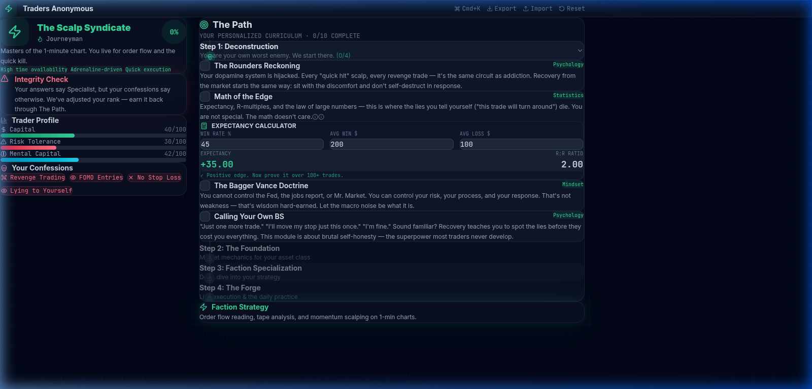
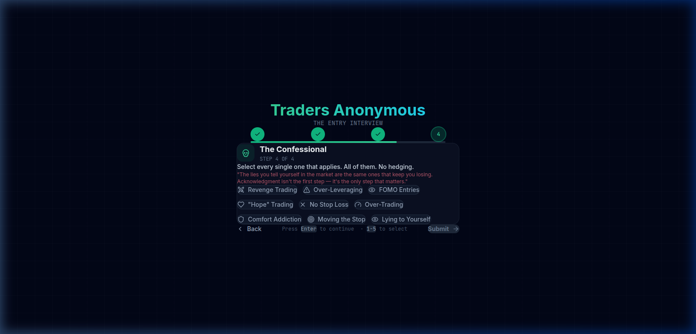
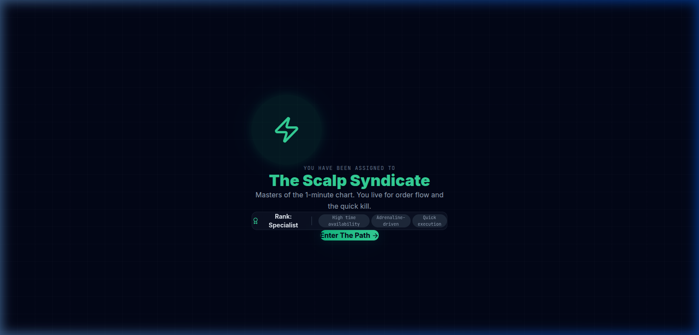

# Traders Anonymous

**An assessment-driven curriculum platform designed to strip away retail "ego" and replace it with professional execution.**

Built with React, Tailwind CSS v4, Framer Motion, and Lucide-React.



## The Experience

### Phase 1: The Entry Interview

A four-step onboarding quiz that feels like a cross between a psychological evaluation and a professional interview.

1. **Experience & Infrastructure** — Years in the market, broker, primary assets
2. **Logistics & Capital** — Capital size, time availability, session preference
3. **The Mirror** — Confrontational questions about what you're *actually* chasing
4. **The Confessional** — Select your bad habits. All of them. No hedging.



### Phase 2: The Factions

Based on your answers, the logic engine assigns you a **Skill Level** and a **Faction**:

| Faction | Profile | Focus |
|---|---|---|
| ⚡ **The Scalp Syndicate** | High time, adrenaline-driven | Order flow, 1-min charts |
| 🌐 **The Macro Order** | High capital, patient | Fundamentals, daily/weekly trends |
| 🤖 **The Algorithm Hive** | Systematic, rule-based | Backtested systems, zero emotion |
| 🔄 **The Contrarian Cult** | Fade the crowd | Mean reversion, sentiment extremes |

**Skill Levels:** Apprentice → Journeyman → Specialist → Architect



### Phase 3: The Path

A personalized curriculum with four stages:

- **Deconstruction** — Killing the Gambler, Math of the Edge, The Serenity Principle, Calling Your Own BS
- **The Foundation** — Market microstructure and tape reading for your asset class
- **Faction Specialization** — Battle-tested setups and edge quantification
- **The Forge** — Pre-market rituals and trade journaling

## Quick Start

```bash
npm install
npm run dev
```

## Tech Stack

- **React 19** + **Vite 6**
- **Tailwind CSS v4** (via `@tailwindcss/vite`)
- **Framer Motion** — page transitions, faction reveal animation
- **Lucide-React** — iconography

## Design

- Dark-mode terminal aesthetic (Slate-950 background)
- Glassmorphism cards with backdrop blur
- Emerald-500 (Win) / Rose-500 (Risk) accent system
- Inter + JetBrains Mono typography
- Keyboard shortcuts (`Enter` to advance, `1-5` to select)
- `localStorage` persistence

---

*Fall. Lose. Adapt. Then WIN.*
